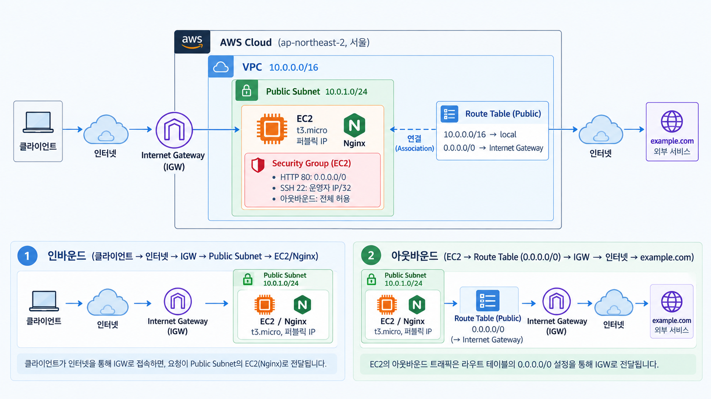

# AWS 기초 웹 인프라 구축

AWS 서울 리전에서 VPC 기반 웹 서비스 인프라를 설계·구축하고, Security Group과 IAM 최소 권한을 적용한 EC2/Nginx 서비스를 배포·검증한 프로젝트입니다. 인프라 생성·검증·정리 과정은 AWS CLI 스크립트로 자동화했습니다.

---

## 아키텍처



### 통신 흐름

- **웹 요청**: `사용자 → Internet Gateway → Public Subnet → Security Group(80) → EC2의 Nginx`
- **서버 관리**: `운영자 → Internet Gateway → Security Group(22, 운영자 IP/32) → EC2`
- **아웃바운드**: `EC2 → Route Table(0.0.0.0/0) → Internet Gateway → 인터넷`

## 인프라 구성

| AWS 리소스 | 설정 | 역할 |
|-------------|------|------|
| **VPC** | `10.0.0.0/16` | 프로젝트 전용 가상 네트워크 |
| **Public Subnet** | `10.0.1.0/24`, `ap-northeast-2a` | 퍼블릭 EC2 배치 영역, 퍼블릭 IPv4 자동 할당 |
| **Internet Gateway** | VPC에 연결 | VPC와 인터넷 연결 |
| **Route Table** | `0.0.0.0/0 → Internet Gateway` | Public Subnet의 인터넷 경로 |
| **EC2** | Ubuntu 24.04 LTS, micro급 | Nginx 웹 서버 실행 |
| **EBS** | gp3 8 GiB, `DeleteOnTermination=true` | EC2 루트 스토리지 |
| **Security Group** | HTTP 80 전체 허용, SSH 22 운영자 IP `/32` | EC2 인바운드 접근 제어 |
| **IAM** | `codyssey-infra`, 서울 리전 및 `t2.micro`·`t3.micro` 제한 | AWS API 최소 권한 적용 |
| **Nginx** | `/`, `/health` | 웹 페이지 및 헬스체크 응답 |

---

## 실행 환경 및 제약 사항

| 구분 | 내용 |
|------|------|
| 로컬 환경 | Bash가 실행되는 macOS/Linux 또는 Windows WSL |
| 필수 도구 | AWS CLI v2, `curl`, OpenSSH 클라이언트 |
| AWS 계정 | 루트 계정이 아닌 `codyssey-infra` IAM 사용자 사용 |
| 배포 위치 | 서울 리전 `ap-northeast-2`, 단일 AZ |
| 인스턴스 | `t2.micro` 또는 `t3.micro` 1대, EBS gp3 8 GiB |
| 보안 | HTTP 80만 전체 공개, SSH 22는 운영자 IP `/32`로 제한 |
| 범위 제외 | ALB, Auto Scaling, RDS, HTTPS, 고가용성 구성 |

키페어 개인키는 `~/.ssh/codyssey-key.pem`에 권한 `400`으로 보관하며 저장소에 커밋하지 않습니다.

아래 명령으로 프로젝트 실행에 필요한 AWS CLI, Bash, curl, SSH가 설치되어 있는지 확인합니다.

```bash
aws --version
bash --version
curl --version
ssh -V
```

---

## 실행 방법

### 사전 준비

아래 준비를 마친 뒤 프로젝트 루트 디렉터리에서 스크립트를 실행합니다.

1. **AWS IAM 사용자와 권한 준비**

   AWS 루트 계정 대신 `codyssey-infra` IAM 사용자를 준비합니다. 이 사용자에게 [`infra/iam-policy.json`](infra/iam-policy.json)을 고객 관리형 정책 또는 인라인 정책으로 연결해야 합니다. 정책 생성과 사용자 연결은 스크립트가 자동화하지 않습니다. CLI 로그인에 사용할 **Access Key ID**와 **Secret Access Key**도 필요합니다.

   > 자격 증명은 README나 소스 코드에 직접 적거나 Git 저장소에 커밋하지 않습니다.

2. **AWS CLI 자격 증명 설정**

   WSL/Linux 셸에서 아래 명령을 실행하고 IAM 사용자의 자격 증명을 입력합니다. 기본 리전은 이 프로젝트가 사용하는 서울 리전 `ap-northeast-2`, 출력 형식은 `json`으로 설정합니다.

   ```bash
   aws configure
   # AWS Access Key ID: 발급받은 Access Key ID
   # AWS Secret Access Key: 발급받은 Secret Access Key
   # Default region name: ap-northeast-2
   # Default output format: json
   ```

   설정이 올바른지 다음 명령으로 확인합니다. 오류 없이 IAM 사용자 정보가 출력되면 준비가 완료된 것입니다.

   ```bash
   aws sts get-caller-identity
   aws configure get region
   ```

   호출자 정보와 `ap-northeast-2`가 출력되는지 확인합니다. 스크립트도 실행 시 리전을 서울로 설정하지만, 다른 프로젝트와 혼동하지 않도록 CLI 설정을 먼저 확인하는 편이 안전합니다.

3. **프로젝트 디렉터리로 이동**

   아래 명령을 실행했을 때 `infra`, `scripts`, `README.md`가 보이는 위치여야 합니다.

   ```bash
   cd B6-1.aws-infra-base
   ls
   ```

> `provision.sh`는 실행한 컴퓨터의 현재 공인 IP를 확인해 그 IP에만 SSH 접속을 허용합니다. 따라서 실행 중에는 인터넷 연결이 필요하며, 실행 후 공인 IP가 바뀌면 SSH 접속이 제한될 수 있습니다.

### 실행 설정

별도 설정이 없으면 아래 기본값을 사용합니다. 과제의 리전과 IAM 정책이 서울 리전으로 고정되어 있으므로 `REGION`은 변경하지 않습니다.

| 환경변수 | 기본값 | 용도 |
|------|------|------|
| `REGION` / `AZ` | `ap-northeast-2` / `ap-northeast-2a` | 리소스 생성 위치 |
| `INSTANCE_TYPE` | `t2.micro` | EC2 유형. IAM 정책상 `t2.micro`, `t3.micro`만 허용 |
| `VOLUME_SIZE` | `8` | 루트 EBS 크기(GiB) |
| `SSH_CIDR` | 현재 공인 IP `/32` 자동 조회 | SSH 허용 대역을 직접 지정할 때 사용 |
| `PROJECT_TAG` | `codyssey-b6-1` | 검증·삭제 대상 식별 태그 |
| `KEY_NAME` / `KEY_FILE` | `codyssey-key` / `~/.ssh/codyssey-key.pem` | EC2 키페어와 로컬 개인키 경로 |

AWS의 프리 티어 대상은 계정과 시점에 따라 다를 수 있습니다. 생성 전에 아래 명령으로 대상 유형을 확인하고, `t2.micro`가 대상이 아니면 `t3.micro`로 실행합니다.

```bash
aws ec2 describe-instance-types \
  --filters Name=free-tier-eligible,Values=true \
  --query 'InstanceTypes[].InstanceType' --output text
```

### 실행 순서

다음 다섯 단계를 순서대로 실행합니다.

1. **인프라 자동 생성**

   ```bash
   bash scripts/provision.sh
   # t3.micro를 사용해야 하는 계정:
   # INSTANCE_TYPE=t3.micro bash scripts/provision.sh
   ```

   `provision.sh`는 VPC, Public Subnet, Internet Gateway, Route Table, Security Group, Key Pair와 EC2를 차례대로 생성합니다. 각 리소스에는 `Project=codyssey-b6-1` 태그를 붙여 이후 검증과 정리 대상을 구분합니다.

2. **Nginx 설치 대기**

   ```bash
   PUBLIC_IP="x.x.x.x"  # provision.sh가 출력한 Public IPv4로 교체
   ssh -i ~/.ssh/codyssey-key.pem ubuntu@"$PUBLIC_IP" 'cloud-init status --wait'
   ```

   EC2 최초 부팅 시 [`user-data.sh`](infra/user-data.sh)가 Nginx를 설치하고 `/`와 `/health` 응답을 설정합니다. EC2의 `running` 상태는 초기화 완료를 의미하지 않으므로 `cloud-init`이 끝난 뒤 검증합니다. SSH가 아직 준비되지 않았다면 잠시 후 같은 명령을 다시 실행합니다.

3. **정상 작동 확인 — 방식 (A) 브라우저 접속**

   로컬 컴퓨터의 브라우저 주소창에 다음 URL을 입력합니다. `<퍼블릭IP>`는 `provision.sh`가 출력한 Public IPv4로 바꿉니다.

   ```text
   http://<퍼블릭IP>
   ```

   Nginx 페이지가 표시되면 외부 접속이 정상입니다. 접속 URL과 페이지를 확인할 수 있도록 화면을 캡처해 접속 증빙으로 남깁니다.

4. **추가 자동 검증**

   ```bash
   bash scripts/verify.sh
   ```

   네트워크, 보안 그룹, 외부 HTTP 응답, SSH, Nginx와 아웃바운드 통신에 관한 11개 항목을 자동으로 점검하고 결과를 `docs/verification.log`에 기록합니다. AWS 연결 없이 보안 그룹 판정 로직만 확인하려면 `bash scripts/test-sg-rules.sh`를 실행합니다. IAM 정책 연결 여부와 리소스 삭제 완료 여부는 검증 범위에 포함되지 않습니다.

5. **실습 리소스 삭제**

   ```bash
   bash scripts/cleanup.sh
   ```

   실습 종료 후 불필요한 과금을 방지하기 위해 EC2, Subnet, VPC 등 생성한 리소스를 의존 관계의 역순으로 삭제합니다. 수동 AWS CLI 정리 결과와 최종 확인 항목은 [리소스 정리 체크리스트](docs/cleanup-checklist.md)에 기록했습니다.

---

## 보안 및 권한

### Security Group — 서버로 들어오고 나가는 통신 제한

| 방향 | 포트 | 허용 대상 | 설정 이유 |
|------|------|-------------|------|
| 인바운드 | HTTP 80 | `0.0.0.0/0` (모든 IP) | 웹 서비스는 누구나 접속할 수 있어야 하므로 허용 |
| 인바운드 | SSH 22 | 운영자 공인 IP `/32` | 서버 관리용 접속은 운영자만 할 수 있도록 제한 |
| 아웃바운드 | 전체 | `0.0.0.0/0` (모든 IP) | 패키지 설치, 업데이트 등 서버에서 인터넷에 접속해야 하는 작업을 위해 허용 |

`0.0.0.0/0`에서 모든 포트에 접근할 수 있도록 하는 규칙은 만들지 않았습니다. 실제 Security Group은 `verify.sh`가 검사하고, `test-sg-rules.sh`는 판정 함수의 테스트 입력만 검사합니다.

SSH에 접속할 수 있는 IP는 `provision.sh`를 실행할 때 현재 운영자의 공인 IP를 확인하여 `/32` 형태로 자동 등록합니다. 운영자의 공인 IP 변경으로 발생한 기존 SSH 접속 차단 문제는 [트러블슈팅 Case 3](docs/troubleshooting.md)에 기록했습니다.

### IAM — AWS에서 수행할 수 있는 작업과 범위를 제한

콘솔·CLI 접근은 루트 계정이 아닌 `codyssey-infra` IAM 사용자로만 수행했고, 부여한 권한은 [`infra/iam-policy.json`](infra/iam-policy.json) 에 정의했습니다.

| 설정 | 내용 |
|------|------|
| 사용 가능한 서비스 | EC2, VPC, Security Group 등 인프라 구성에 필요한 작업만 허용 |
| 사용 가능 리전 | `aws:RequestedRegion = ap-northeast-2` (서울 리전)에서만 작업할 수 있도록 제한 |
| 과금 가드레일 | `ec2:RunInstances` 를 `t2.micro` / `t3.micro` 만 생성할 수 있도록 제한 |
| 비용 확인 | `ce:GetCostAndUsage` 비용 정보 읽기 권한만 허용 |

Security Group은 EC2의 네트워크 통신을 제어하고, IAM은 AWS 리소스를 다루는 API 권한을 제어합니다. 두 설정은 서로 다른 보안 계층이므로 모두 적용해야 합니다. IAM 권한 누락 사례는 [트러블슈팅 Case 1](docs/troubleshooting.md)에 기록했습니다.

---

## 정상 동작 확인

외부 접속 검증은 방식 **(A) 브라우저 접속**으로 진행했습니다.

- 접속 URL: `http://3.34.96.150`
- 확인 결과: 브라우저에 Nginx의 `Welcome to nginx!` 페이지가 정상적으로 표시됨
- 접속 증빙: [브라우저 접속 화면](docs/images/health-check.png)

네트워크·보안·웹 서버의 세부 항목은 별도로 자동 검증했으며, 11개 항목이 모두 통과한 결과는 [전체 자동 검증 로그](docs/verification.log)에서 확인할 수 있습니다.

## 과제 결과물

| 결과물 | 구현 및 확인 위치 |
|--------|-------------------|
| 아키텍처 다이어그램 | [AWS 인프라 구성과 트래픽 흐름](docs/images/architecture.png) |
| 외부 접속 검증 | 방식 A(브라우저), [접속 화면](docs/images/health-check.png), [자동 검증 기록](docs/verification.log) |
| 트러블슈팅 보고서 | [실제 장애 3건과 진단 절차](docs/troubleshooting.md) |
| 리소스 정리 체크리스트 | [삭제 순서, 수동 검증과 완료 기록](docs/cleanup-checklist.md) |

## 리소스 정리

저장소의 [`scripts/cleanup.sh`](scripts/cleanup.sh)는 EC2 종료 후 EIP, 잔여 EBS, Route Table, IGW, Subnet, Security Group, VPC, AWS 키페어 순으로 프로젝트 태그가 붙은 리소스를 정리하고 남은 항목을 조회합니다. 이번 실습에서는 2026-09-20에 AWS CLI로 리소스 의존 관계를 고려해 직접 삭제하고 조회 결과를 확인했으며, 상세 결과는 [리소스 정리 체크리스트](docs/cleanup-checklist.md)에 기록했습니다.

루트 볼륨은 `DeleteOnTermination=true`이고 Elastic IP는 생성하지 않았습니다. AWS 키페어 삭제와 별개로 남는 로컬 개인키 `~/.ssh/codyssey-key.pem`도 수동으로 삭제했으며, Billing Dashboard에서 최종 과금 항목을 확인했습니다.

---

## 디렉토리 구조

```
B6-1.aws-infra-base/
├── docs/                           # 제출 문서 및 증빙
│   ├── troubleshooting.md          # 트러블슈팅 보고서
│   ├── cleanup-checklist.md        # 리소스 정리 체크리스트
│   ├── verification.log            # verify.sh 실행 기록
│   └── images/
│       ├── architecture.png         # 아키텍처 다이어그램
│       └── health-check.png         # 브라우저 외부 접속 결과
├── infra/                          # 인프라 정의
│   ├── iam-policy.json             # IAM 사용자에 부여한 최소 권한 정책
│   └── user-data.sh                # EC2 부팅 시 Nginx 설치·설정
├── scripts/                        # 실행 스크립트
│   ├── common.sh                   # 공통 설정 · 보안 그룹 규칙 판정
│   ├── provision.sh                # 인프라 생성
│   ├── verify.sh                   # 요구사항 검증
│   ├── cleanup.sh                  # 리소스 삭제 (생성 역순)
│   └── test-sg-rules.sh            # 보안 그룹 판정 로직 단위 테스트
└── README.md
```
