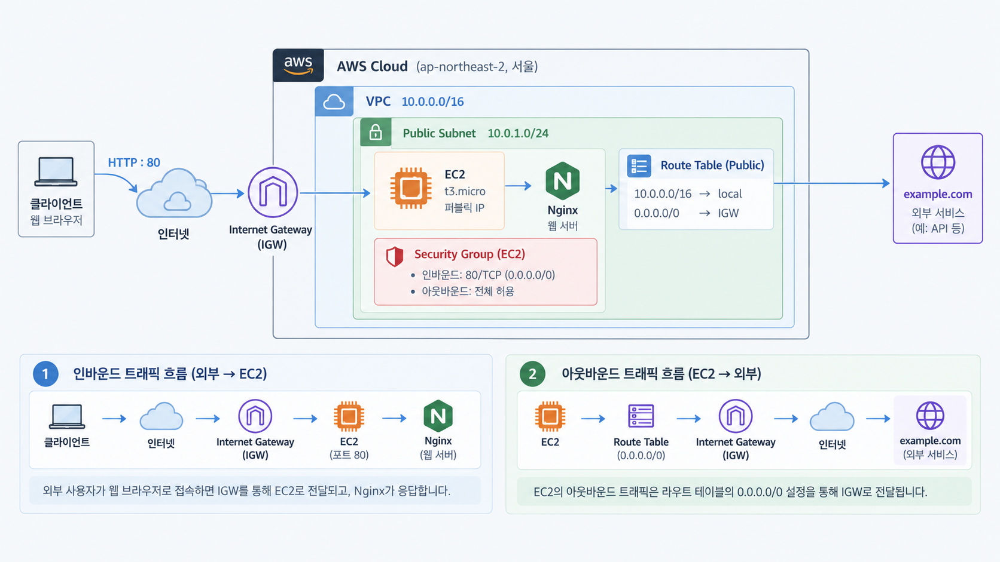
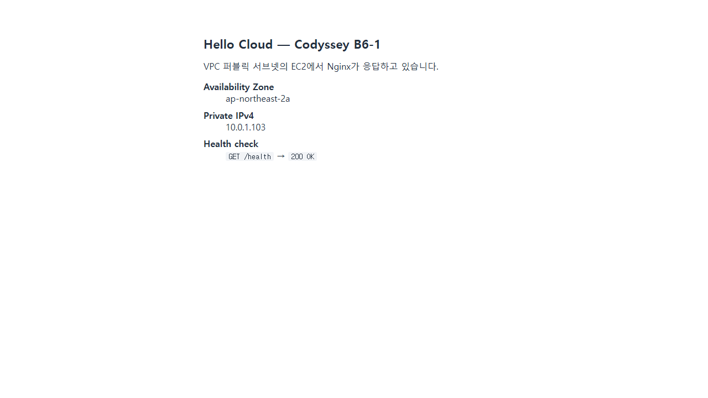

# AWS 기초 웹 인프라 구축

이 프로젝트는 VPC로 격리된 네트워크를 구성하고, 가상 서버에 애플리케이션을 배포해 외부에서 접속 가능한 웹 서비스를 만드는 것을 목표로 합니다. 네트워크와 서버 구축부터 보안·권한 설정, 접속 검증, 문제 해결, 리소스 정리까지의 과정을 담았습니다.

### 핵심 구성

AWS 클라우드 환경을 네트워크, 서버, 보안, 권한의 네 영역으로 나누어 구성했습니다.

| 영역 | 정의 | 주요 구성 요소 | 구현 내용 |
|------|------|----------------|-----------|
| **네트워크** | 컴퓨터와 서비스가 데이터를 주고받도록 연결하는 구조 | VPC, Public Subnet, Internet Gateway, Route Table | 격리된 VPC 안에 Public Subnet을 만들고 인터넷 통신 경로를 연결합니다. |
| **서버** | 애플리케이션을 실행하고 사용자의 요청을 처리하는 컴퓨터 | EC2, Public IP, Nginx | Public IP가 할당된 EC2에 Nginx를 배포하고 `/`와 `/health` 응답을 제공합니다. |
| **보안** | 서비스에 허용할 네트워크 접근 범위를 정하는 규칙 | Security Group, HTTP 80, SSH 22 | HTTP 80은 공개하고 SSH 22는 운영자 IP `/32`에만 허용합니다. |
| **권한** | 사용자가 AWS에서 수행할 수 있는 작업의 범위 | IAM 사용자·정책, 최소 권한 원칙 | EC2, VPC, Security Group 구성에 필요한 권한만 허용하고 전체 관리자 권한은 제외합니다. |

> 더 자세한 용어와 개념은 [AWS 기초 웹 인프라 학습 노트](docs/study-notes.md)에서 확인할 수 있습니다.

---

## 아키텍처



AWS Region에 VPC를 만들고, 그 안의 Public Subnet에 Nginx가 실행되는 EC2 인스턴스를 배치했습니다. 외부 요청은 다음 경로를 따라 웹 서버에 도달합니다.

`사용자 → Internet Gateway → Public Subnet → Security Group → EC2 → Nginx`

### 인프라 구축 흐름

1. **권한 준비**

   루트 계정 대신 실습에 필요한 권한만 가진 IAM 사용자를 사용합니다.

2. **네트워크 구성**

   VPC를 생성하고 그 안에 Public Subnet을 만듭니다.

3. **인터넷 연결과 접근 제어**

   Internet Gateway와 Route Table로 인터넷 경로를 만들고, Security Group으로 HTTP와 SSH의 접근 범위를 제한합니다.

4. **웹 서버 배포**

   Public Subnet에 EC2를 생성하고 `user-data`로 Nginx를 자동 설치합니다.

5. **동작 검증**

   SSH로 서버 내부 상태를 확인하고, Public IP와 `/health`를 이용해 외부 접속을 검증합니다.

6. **기록과 정리**

   문제와 해결 과정을 기록한 뒤, 과금 방지를 위해 생성한 리소스를 모두 삭제합니다.

## 인프라 구성

| 영역 | 구성 |
|------|------|
| **배포 위치** | AWS 서울 Region(`ap-northeast-2`), AZ `ap-northeast-2a` |
| **네트워크** | VPC `10.0.0.0/16` 안에 Public Subnet `10.0.1.0/24` 구성 |
| **인터넷 연결** | Internet Gateway와 `0.0.0.0/0` Route 연결, 퍼블릭 IPv4 자동 할당 |
| **서버** | EC2 `t2.micro`, Ubuntu 24.04 LTS |
| **스토리지** | EBS gp3 8 GiB, EC2 인스턴스 삭제 시 함께 삭제 |
| **웹 서비스** | Nginx가 HTTP 80번 포트에서 `/`와 `/health` 응답 제공 |
| **접근 제어** | HTTP 80은 전체 공개, SSH 22는 운영자 IP `/32`에만 허용 |
| **권한 관리** | `codyssey-infra` IAM 사용자에게 인프라 구성과 비용 확인에 필요한 권한만 부여 |
| **자동화** | AWS CLI 스크립트로 인프라 생성, 검증, 삭제 수행 |

---

## 실행 방법

### 사전 준비

AWS CLI v2와 `codyssey-infra` IAM 사용자의 자격 증명이 필요합니다. `aws configure`로 자격 증명을 설정한 뒤 WSL/Linux 셸에서 실행합니다.

### 실행 순서

다음 네 단계를 순서대로 실행합니다.

1. **인프라 자동 생성**

   ```bash
   bash scripts/provision.sh
   ```

   VPC, Public Subnet, Internet Gateway, Route Table, Security Group, Key Pair를 차례대로 만들고, 마지막으로 Nginx가 설치될 EC2 인스턴스를 생성합니다.

2. **Nginx 설치 대기**

   ```bash
   sleep 90
   ```

   EC2가 시작된 직후 [`user-data.sh`](infra/user-data.sh)가 내부에서 Nginx를 자동으로 설치합니다. EC2의 `running` 상태는 설치 완료를 의미하지 않으므로 90초 동안 기다립니다.

3. **정상 작동 검증**

   ```bash
   bash scripts/verify.sh
   ```

   HTTP 80번 포트 공개 여부, SSH 접속, Nginx 실행 상태, `/health`의 `200 OK` 응답 등 요구사항 11개를 자동으로 점검합니다.

4. **실습 리소스 삭제**

   ```bash
   bash scripts/cleanup.sh
   ```

   실습 종료 후 불필요한 과금을 방지하기 위해 EC2, Subnet, VPC 등 생성한 리소스를 의존 관계의 역순으로 삭제합니다.

### 자동 설정

`provision.sh`는 모든 리소스에 `Project=codyssey-b6-1` 태그를 붙여 검증과 삭제 대상을 구분합니다. [`infra/user-data.sh`](infra/user-data.sh)는 EC2 최초 부팅 시 Nginx를 설치하고 `/`와 `/health` 응답을 설정합니다.

---

## 보안 및 권한

### Security Group — 네트워크 계층 접근 제어

| 방향 | 포트 | 소스 / 대상 | 근거 |
|------|------|-------------|------|
| 인바운드 | 80/tcp | `0.0.0.0/0` | 웹 서비스는 누구나 접근해야 하므로 공개 |
| 인바운드 | 22/tcp | 운영자 공인 IP `/32` | 서버 전권을 갖는 포트. 공개하면 즉시 무차별 로그인 시도의 표적이 된다 |
| 아웃바운드 | 전체 | `0.0.0.0/0` | 패키지 설치·보안 업데이트에 필요. 기본값 유지 |

전체 포트를 공개하는 규칙은 만들지 않았으며, [`scripts/test-sg-rules.sh`](scripts/test-sg-rules.sh)가 이를 검사합니다. SSH 허용 범위는 `provision.sh` 실행 시점의 운영자 공인 IP `/32`로 자동 설정합니다. IP 변경으로 발생한 접속 문제는 [트러블슈팅 Case 3](docs/troubleshooting.md)에 기록했습니다.

### IAM — API 호출 권한 제어

콘솔·CLI 접근은 루트 계정이 아닌 `codyssey-infra` IAM 사용자로만 수행했고, 부여한 정책은 [`infra/iam-policy.json`](infra/iam-policy.json) 입니다.

| 설계 | 내용 |
|------|------|
| 서비스 범위 | EC2/VPC/보안 그룹 조작에 필요한 액션만 열거. S3·RDS 등 무관한 서비스 권한 없음 |
| 리전 제한 | `aws:RequestedRegion = ap-northeast-2` 조건으로 다른 리전 호출 차단 |
| 과금 가드레일 | `ec2:RunInstances` 를 `t2.micro` / `t3.micro` 외 타입에 대해 명시적 `Deny` |
| 정리 확인용 | `ce:GetCostAndUsage` 읽기 권한만 추가 |

Security Group은 EC2의 네트워크 통신을 제어하고, IAM은 AWS 리소스를 다루는 API 권한을 제어합니다. 두 설정은 서로 다른 보안 계층이므로 모두 적용해야 합니다. IAM 권한 누락 사례는 [트러블슈팅 Case 1](docs/troubleshooting.md)에 기록했습니다.

---

## 검증 결과

**검증 방식: (B) 헬스체크 호출** — 응답 본문이 고정되어 있어 증빙이 명확하기 때문입니다. (A) 브라우저 접속도 함께 확인했습니다.

| 구분 | 내용 |
|------|------|
| 접속 주소 | `http://43.202.71.184/health` |
| 응답 | `200 OK`, 본문 `OK` |
| 함께 확인 | `http://43.202.71.184/` → `200`, 정적 페이지 표시 |

```console
$ curl -i http://43.202.71.184/health
HTTP/1.1 200 OK
Server: nginx/1.24.0 (Ubuntu)
Content-Type: text/plain
Content-Length: 3

OK
```



### 요구사항 검증 결과

`scripts/verify.sh` 가 아래 항목(마지막 정리 항목 제외)을 한 번에 점검하고, PASS/FAIL 판정을 포함한 전체 출력을 [`docs/verification.log`](docs/verification.log) 에 남깁니다. 11개 항목 전부 통과했습니다.

| 구분 | 요구사항 | 검증 방법 |
|------|----------|-----------|
| 네트워크 | 라우트 `0.0.0.0/0 → IGW` 존재 | `describe-route-tables` 의 게이트웨이 ID 확인 |
| 네트워크 | 서브넷 퍼블릭 IPv4 자동 할당 | `describe-subnets` 의 `MapPublicIpOnLaunch` |
| 네트워크 | 인스턴스의 인터넷 아웃바운드 | 인스턴스 내부 `curl https://example.com` → 200 |
| 컴퓨트 | SSH 접속 가능 | `ssh -i ~/.ssh/codyssey-key.pem ubuntu@43.202.71.184` |
| 컴퓨트 | 웹 서버 실행 상태 | `systemctl is-active nginx` → `active` |
| 컴퓨트 | 로컬 루프백 응답 | 인스턴스 내부 `curl http://localhost` → 200 |
| 보안 | HTTP 80 은 전체 공개 | 보안 그룹 인바운드 규칙 판정 |
| 보안 | SSH 22 는 전체 공개 아님 | 보안 그룹 인바운드 규칙 판정 |
| 보안 | `0.0.0.0/0` 전체 포트 허용 규칙 없음 | 보안 그룹 인바운드 규칙 판정 |
| 외부 접속 | `GET /health` → 200 + 본문 `OK` | 로컬에서 `curl` |
| 운영 | 실습 리소스 정리 완료 | [정리 체크리스트](docs/cleanup-checklist.md) 의 항목별 조회 명령 |

---

## 트러블슈팅

구축과 검증 중 발생한 문제 3건은 [트러블슈팅 보고서](docs/troubleshooting.md)에 증상 → 가설 → 검증 → 조치 → 결과 → 재발 방지 순서로 정리했습니다.

---

## 리소스 정리

[`docs/cleanup-checklist.md`](docs/cleanup-checklist.md) 에 삭제 순서와 항목별 확인 명령, 실행 기록을 남겼습니다. 2026-08-10 23:58 정리 완료했습니다.

`cleanup.sh` 는 의존 관계 역순(EC2 → EIP → EBS → 라우트 테이블 → IGW → 서브넷 → SG → VPC → 키페어)으로 삭제하고, 마지막에 남은 리소스를 다시 조회해 출력합니다.
구조적으로도 과금 위험을 줄였습니다. 루트 볼륨은 `DeleteOnTermination=true` 이고, Elastic IP 는 아예 할당하지 않았습니다.

---

## 디렉토리 구조

```
B6-1.aws-infra-base/
├── docs/                           # 제출 문서 및 증빙
│   ├── architecture.png            # 아키텍처 다이어그램
│   ├── study-notes.md              # AWS 기초 용어와 과제 학습 노트
│   ├── troubleshooting.md          # 트러블슈팅 보고서
│   ├── cleanup-checklist.md        # 리소스 정리 체크리스트
│   ├── verification.log            # verify.sh 실행 기록
│   └── images/                     # 접속·과금 증빙 스크린샷
├── infra/                          # 인프라 정의
│   ├── iam-policy.json             # IAM 사용자에 부여한 최소 권한 정책
│   └── user-data.sh                # EC2 부팅 시 Nginx 설치·설정
├── scripts/                        # 실행 스크립트
│   ├── common.sh                   # 공통 설정 · 보안 그룹 규칙 판정
│   ├── provision.sh                # 인프라 생성
│   ├── verify.sh                   # 요구사항 검증
│   ├── cleanup.sh                  # 리소스 삭제 (생성 역순)
│   ├── test-sg-rules.sh            # 보안 그룹 판정 로직 단위 테스트
│   └── render_architecture.py      # architecture.png 생성
└── README.md
```

---

## 제약 사항

- 프리티어 범위 내에서 진행합니다. 서울 리전 프리티어 대상인 `t2.micro` 를 기본값으로 두었고, EBS 는 8 GiB 로 시작합니다
- 루트 계정으로는 콘솔·CLI 에 접근하지 않으며, `codyssey-infra` IAM 사용자만 사용합니다
- 키페어 개인키는 생성 시점에만 내려받을 수 있어 재발급이 불가능합니다. `~/.ssh/codyssey-key.pem` 에 권한 `400` 으로 보관하며 저장소에 커밋하지 않습니다
- 단일 AZ · 단일 인스턴스 구성이므로 고가용성은 범위에 없습니다. ALB, Auto Scaling, RDS, HTTPS(보너스 과제)는 구현하지 않았습니다
