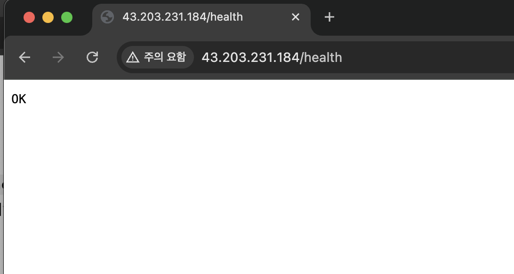

# AWS 기초 웹 인프라 구축

AWS 서울 리전에 VPC와 Public Subnet을 구성하고, Ubuntu EC2 한 대에 Nginx를 배포해 외부에서 접근 가능한 웹 서비스를 만드는 프로젝트입니다. AWS CLI 스크립트로 인프라 생성, 요구사항 검증, 리소스 정리를 반복할 수 있으며 Security Group과 IAM 정책으로 네트워크 접근 및 AWS API 권한을 제한합니다.

---

## 프로젝트 한눈에 보기

<table>
  <thead>
    <tr>
      <th width="15%">영역</th>
      <th width="27%">정의</th>
      <th width="58%">구현 내용</th>
    </tr>
  </thead>
  <tbody>
    <tr>
      <td width="15%"><strong>네트워크</strong></td>
      <td>컴퓨터와 서비스가 데이터를 주고받도록 연결하는 구조</td>
      <td><code>10.0.0.0/16</code> VPC 안에 <code>10.0.1.0/24</code> Public Subnet을 만들고, Internet Gateway와 Route Table의 <code>0.0.0.0/0</code> 경로를 연결해 인터넷 통신을 구성합니다.</td>
    </tr>
    <tr>
      <td width="15%"><strong>서버</strong></td>
      <td>애플리케이션을 실행하고 사용자의 요청을 처리하는 컴퓨터</td>
      <td>Public Subnet에 Ubuntu 24.04 LTS 기반 micro급 EC2를 생성하고 Public IP를 할당합니다. <code>user-data</code>로 Nginx를 설치해 <code>/</code>와 <code>/health</code> 응답을 제공합니다.</td>
    </tr>
    <tr>
      <td width="15%"><strong>보안</strong></td>
      <td>서비스에 허용할 네트워크 접근 범위를 정하는 규칙</td>
      <td>Security Group에서 HTTP 80은 <code>0.0.0.0/0</code>에 공개하고 SSH 22는 운영자 IP <code>/32</code>에만 허용합니다. 전체 포트를 공개하는 규칙은 만들지 않습니다.</td>
    </tr>
    <tr>
      <td width="15%"><strong>권한</strong></td>
      <td>사용자가 AWS에서 수행할 수 있는 작업의 범위</td>
      <td><code>codyssey-infra</code> IAM 사용자에게 EC2, VPC, Security Group 구성과 비용 확인에 필요한 권한만 부여합니다. 리소스 작업은 서울 Region으로 제한하고, EC2 생성은 <code>t2.micro</code>·<code>t3.micro</code>만 허용하며 <code>AdministratorAccess</code>는 부여하지 않습니다.</td>
    </tr>
  </tbody>
</table>

> 더 자세한 용어와 개념은 [AWS 기초 웹 인프라 학습 노트](docs/study-notes.md)에서 확인할 수 있습니다.

---

## 아키텍처


### 통신 흐름

- **서버 관리**: `내 노트북 → 인터넷 → Internet Gateway → Security Group의 22번 포트 → EC2`
- **웹 서비스 접속**: `브라우저 또는 curl → 인터넷 → Internet Gateway → Security Group의 80번 포트 → EC2의 Nginx`
- **인터넷 연결 확인**: `EC2 → Route Table → Internet Gateway → 인터넷 → example.com` 순서로 `curl` 요청을 보냅니다.

EC2에 Public IP가 있어야 외부와 통신할 수 있고, Public Subnet의 Route Table에는 `0.0.0.0/0 → Internet Gateway` 경로가 필요합니다. Security Group은 HTTP 80번 포트를 전체에 공개하지만, SSH 22번 포트는 운영자의 공인 IP `/32`에만 허용합니다.

## 인프라 구성

| 영역 | 구성 |
|------|------|
| **배포 위치** | AWS 서울 Region(`ap-northeast-2`), AZ `ap-northeast-2a` |
| **네트워크** | VPC `10.0.0.0/16` 안에 Public Subnet `10.0.1.0/24` 구성 |
| **인터넷 연결** | Internet Gateway와 `0.0.0.0/0` Route 연결, 퍼블릭 IPv4 자동 할당 |
| **서버** | EC2 micro급(`t2.micro` 기본값, 환경변수로 변경 가능), Ubuntu 24.04 LTS |
| **스토리지** | EBS gp3 8 GiB, EC2 인스턴스 삭제 시 함께 삭제 |
| **웹 서비스** | Nginx가 HTTP 80번 포트에서 `/`와 `/health` 응답 제공 |
| **접근 제어** | HTTP 80은 전체 공개, SSH 22는 운영자 IP `/32`에만 허용 |
| **권한 관리** | `codyssey-infra` IAM 사용자에게 인프라 구성과 비용 확인에 필요한 권한만 부여 |
| **자동화** | AWS CLI 스크립트로 인프라 생성, 검증, 삭제 수행 |

---

## 실행 방법

### 사전 준비

아래 준비를 마친 뒤 프로젝트 루트 디렉터리에서 스크립트를 실행합니다.

1. **AWS IAM 사용자와 권한 준비**

   AWS 루트 계정 대신 `codyssey-infra` IAM 사용자를 준비합니다. 이 사용자에게 [`infra/iam-policy.json`](infra/iam-policy.json)을 고객 관리형 정책 또는 인라인 정책으로 연결해야 합니다. 정책 생성과 사용자 연결은 스크립트가 자동화하지 않습니다. CLI 로그인에 사용할 **Access Key ID**와 **Secret Access Key**도 필요합니다.

   > 자격 증명은 README나 소스 코드에 직접 적거나 Git 저장소에 커밋하지 않습니다.

2. **필수 도구 설치**

   스크립트는 Bash를 사용하므로 Windows에서는 **WSL**, macOS/Linux에서는 기본 터미널을 사용합니다. 해당 환경에 다음 도구가 설치되어 있어야 합니다.

   - AWS CLI v2: AWS 리소스 생성·조회·삭제
   - `curl`: 현재 공인 IP와 웹 서버 응답 확인
   - OpenSSH 클라이언트(`ssh`): EC2 내부 상태 확인

   다음 명령으로 설치 여부를 확인할 수 있습니다.

   ```bash
   aws --version
   bash --version
   curl --version
   ssh -V
   ```

3. **AWS CLI 자격 증명 설정**

   WSL/Linux 셸에서 아래 명령을 실행하고 IAM 사용자의 자격 증명을 입력합니다. 기본 리전은 이 프로젝트가 사용하는 서울 리전 `ap-northeast-2`, 출력 형식은 `json`으로 설정합니다.

   ```bash
   aws configure
   # AWS Access Key ID: 발급받은 Access Key ID
   # AWS Secret Access Key: 발급받은 Secret Access Key
   # Default region name: ap-northeast-2
   # Default output format: json
   ```

   설정이 올바른지 다음 명령으로 확인합니다. 오류 없이 IAM 사용자 정보가 출력되면 준비가 완료된 것입니다.

   ```bash
   aws sts get-caller-identity
   aws configure get region
   ```

   호출자 정보와 `ap-northeast-2`가 출력되는지 확인합니다. 스크립트도 실행 시 리전을 서울로 설정하지만, 다른 프로젝트와 혼동하지 않도록 CLI 설정을 먼저 확인하는 편이 안전합니다.

4. **프로젝트 디렉터리로 이동**

   아래 명령을 실행했을 때 `infra`, `scripts`, `README.md`가 보이는 위치여야 합니다.

   ```bash
   cd B6-1.aws-infra-base
   ls
   ```

> `provision.sh`는 실행한 컴퓨터의 현재 공인 IP를 확인해 그 IP에만 SSH 접속을 허용합니다. 따라서 실행 중에는 인터넷 연결이 필요하며, 실행 후 공인 IP가 바뀌면 SSH 접속이 제한될 수 있습니다.

### 실행 설정

별도 설정이 없으면 아래 기본값을 사용합니다. 과제의 리전과 IAM 정책이 서울 리전으로 고정되어 있으므로 `REGION`은 변경하지 않습니다.

| 환경변수 | 기본값 | 용도 |
|------|------|------|
| `REGION` / `AZ` | `ap-northeast-2` / `ap-northeast-2a` | 리소스 생성 위치 |
| `INSTANCE_TYPE` | `t2.micro` | EC2 유형. IAM 정책상 `t2.micro`, `t3.micro`만 허용 |
| `VOLUME_SIZE` | `8` | 루트 EBS 크기(GiB) |
| `SSH_CIDR` | 현재 공인 IP `/32` 자동 조회 | SSH 허용 대역을 직접 지정할 때 사용 |
| `PROJECT_TAG` | `codyssey-b6-1` | 검증·삭제 대상 식별 태그 |
| `KEY_NAME` / `KEY_FILE` | `codyssey-key` / `~/.ssh/codyssey-key.pem` | EC2 키페어와 로컬 개인키 경로 |

AWS의 프리 티어 대상은 계정과 시점에 따라 다를 수 있습니다. 생성 전에 아래 명령으로 대상 유형을 확인하고, `t2.micro`가 대상이 아니면 `t3.micro`로 실행합니다.

```bash
aws ec2 describe-instance-types \
  --filters Name=free-tier-eligible,Values=true \
  --query 'InstanceTypes[].InstanceType' --output text
```

### 실행 순서

다음 네 단계를 순서대로 실행합니다.

1. **인프라 자동 생성**

   ```bash
   bash scripts/provision.sh
   # t3.micro를 사용해야 하는 계정:
   # INSTANCE_TYPE=t3.micro bash scripts/provision.sh
   ```

   VPC, Public Subnet, Internet Gateway, Route Table, Security Group, Key Pair를 차례대로 만들고, 마지막으로 Nginx가 설치될 EC2 인스턴스를 생성합니다.

2. **Nginx 설치 대기**

   ```bash
   PUBLIC_IP="x.x.x.x"  # provision.sh가 출력한 Public IPv4로 교체
   ssh -i ~/.ssh/codyssey-key.pem ubuntu@"$PUBLIC_IP" 'cloud-init status --wait'
   ```

   EC2가 시작된 직후 [`user-data.sh`](infra/user-data.sh)가 Nginx를 설치합니다. EC2의 `running` 상태는 초기화 완료를 의미하지 않으므로 `cloud-init`이 끝난 뒤 검증합니다. SSH가 아직 준비되지 않았다면 잠시 후 같은 명령을 다시 실행합니다.

3. **정상 작동 검증**

   ```bash
   bash scripts/verify.sh
   ```

   네트워크, 보안 그룹, 외부 HTTP 응답, SSH, Nginx와 아웃바운드 통신에 관한 11개 항목을 자동으로 점검합니다. 결과는 `docs/verification.log`에 덮어씁니다. IAM 정책 연결 여부와 리소스 삭제 완료 여부는 이 스크립트의 검증 범위가 아닙니다.

4. **실습 리소스 삭제**

   ```bash
   bash scripts/cleanup.sh
   ```

   실습 종료 후 불필요한 과금을 방지하기 위해 EC2, Subnet, VPC 등 생성한 리소스를 의존 관계의 역순으로 삭제합니다.

### 자동 설정

`provision.sh`는 생성 리소스에 `Project=codyssey-b6-1` 태그를 붙여 검증과 삭제 대상을 구분합니다. [`infra/user-data.sh`](infra/user-data.sh)는 EC2 최초 부팅 시 Nginx를 설치하고 `/`와 `/health` 응답을 설정합니다. 보안 그룹 판정 로직만 AWS 연결 없이 확인하려면 `bash scripts/test-sg-rules.sh`를 실행합니다.

---

## 보안 및 권한

### Security Group — 서버로 들어오고 나가는 통신 제한

| 방향 | 포트 | 허용 대상 | 설정 이유 |
|------|------|-------------|------|
| 인바운드 | HTTP 80 | `0.0.0.0/0` (모든 IP) | 웹 서비스는 누구나 접속할 수 있어야 하므로 허용 |
| 인바운드 | SSH 22 | 운영자 공인 IP `/32` | 서버 관리용 접속은 운영자만 할 수 있도록 제한 |
| 아웃바운드 | 전체 | `0.0.0.0/0` (모든 IP) | 패키지 설치, 업데이트 등 서버에서 인터넷에 접속해야 하는 작업을 위해 허용 |

`0.0.0.0/0`에서 모든 포트에 접근할 수 있도록 하는 규칙은 만들지 않았습니다. 실제 Security Group은 `verify.sh`가 검사하고, `test-sg-rules.sh`는 판정 함수의 테스트 입력만 검사합니다.

SSH에 접속할 수 있는 IP는 `provision.sh`를 실행할 때 현재 운영자의 공인 IP를 확인하여 `/32` 형태로 자동 등록합니다. 운영자의 공인 IP 변경으로 발생한 기존 SSH 접속 차단 문제는 [트러블슈팅 Case 3](docs/troubleshooting.md)에 기록했습니다.

### IAM — AWS에서 수행할 수 있는 작업과 범위를 제한

콘솔·CLI 접근은 루트 계정이 아닌 `codyssey-infra` IAM 사용자로만 수행했고, 부여한 권한은 [`infra/iam-policy.json`](infra/iam-policy.json) 에 정의했습니다.

| 설정 | 내용 |
|------|------|
| 사용 가능한 서비스 | EC2, VPC, Security Group 등 인프라 구성에 필요한 작업만 허용 |
| 사용 가능 리전 | `aws:RequestedRegion = ap-northeast-2` (서울 리전)에서만 작업할 수 있도록 제한 |
| 과금 가드레일 | `ec2:RunInstances` 를 `t2.micro` / `t3.micro` 만 생성할 수 있도록 제한 |
| 비용 확인 | `ce:GetCostAndUsage` 비용 정보 읽기 권한만 허용 |

Security Group은 EC2의 네트워크 통신을 제어하고, IAM은 AWS 리소스를 다루는 API 권한을 제어합니다. 두 설정은 서로 다른 보안 계층이므로 모두 적용해야 합니다. IAM 권한 누락 사례는 [트러블슈팅 Case 1](docs/troubleshooting.md)에 기록했습니다.

---

## 정상 동작 확인

과제의 외부 접속 검증은 **(B) 헬스체크 호출** 방식을 선택했습니다. 2026-08-22 검증 당시 `GET http://43.203.231.184/health`가 `200`과 고정 본문 `OK`를 반환했고, 기본 경로 `/`도 `200`을 반환했습니다. 해당 리소스는 검증 후 삭제했으므로 이 IP는 현재 접속 주소가 아니라 당시의 기록입니다.



[`scripts/verify.sh`](scripts/verify.sh)는 태그로 실행 중인 인스턴스를 찾아 다음 11개 항목을 검사합니다.

| 구분 | 자동 검증 항목 | 정상 기준 |
|------|----------------|-----------|
| 네트워크 | 기본 라우트 대상 | `0.0.0.0/0 → IGW` |
| 네트워크 | 서브넷 퍼블릭 IPv4 자동 할당 | `True` |
| 보안 | HTTP 80 전체 공개 | 허용 |
| 보안 | SSH 22 전체 공개 | 미허용 |
| 보안 | 전체 포트 전체 공개 | 미허용 |
| 외부 접속 | `GET /` | `200` |
| 외부 접속 | `GET /health` | `200` |
| 외부 접속 | `/health` 본문 | `OK` |
| 인스턴스 | Nginx 서비스 | `active` |
| 인스턴스 | `curl http://localhost` | `200` |
| 인스턴스 | `curl https://example.com` | `200` |

저장된 실행 결과는 [`docs/verification.log`](docs/verification.log)에서 확인할 수 있으며, 당시 **11개 통과 / 0개 실패**였습니다. 이 자동 검증에는 IAM 정책 연결 여부와 리소스 삭제 결과가 포함되지 않으므로 각각 IAM 콘솔과 정리 체크리스트로 확인합니다.

## 과제 결과물

| 결과물 | 구현 및 확인 위치 |
|--------|-------------------|
| 아키텍처 다이어그램 | [AWS 인프라 구성과 트래픽 흐름](docs/architecture.png) |
| 외부 접속 검증 | 방식 B(`/health`), [접속 화면](docs/images/health-check.png), [자동 검증 기록](docs/verification.log) |
| 트러블슈팅 보고서 | [실제 장애 3건과 진단 절차](docs/troubleshooting.md) |
| 리소스 정리 체크리스트 | [삭제 순서, 조회 명령과 완료 기록](docs/cleanup-checklist.md) |

## 리소스 정리

[`scripts/cleanup.sh`](scripts/cleanup.sh)는 EC2 종료 후 EIP, 잔여 EBS, Route Table, IGW, Subnet, Security Group, VPC, AWS 키페어 순으로 프로젝트 태그가 붙은 리소스를 정리하고 남은 항목을 조회합니다. 2026-08-22의 삭제 결과는 [정리 체크리스트](docs/cleanup-checklist.md)에 기록되어 있습니다.

루트 볼륨은 `DeleteOnTermination=true`이고 Elastic IP는 생성하지 않습니다. AWS 키페어를 삭제해도 로컬 개인키 `~/.ssh/codyssey-key.pem`은 자동 삭제되지 않으므로 더 이상 필요 없다면 별도로 제거합니다.

---

## 디렉토리 구조

```
B6-1.aws-infra-base/
├── docs/                           # 제출 문서 및 증빙
│   ├── architecture.png            # 아키텍처 다이어그램
│   ├── study-notes.md              # AWS 기초 용어와 과제 학습 노트
│   ├── troubleshooting.md          # 트러블슈팅 보고서
│   ├── cleanup-checklist.md        # 리소스 정리 체크리스트
│   ├── verification.log            # verify.sh 실행 기록
│   └── images/
│       └── health-check.png         # 외부 접속 결과
├── infra/                          # 인프라 정의
│   ├── iam-policy.json             # IAM 사용자에 부여한 최소 권한 정책
│   └── user-data.sh                # EC2 부팅 시 Nginx 설치·설정
├── scripts/                        # 실행 스크립트
│   ├── common.sh                   # 공통 설정 · 보안 그룹 규칙 판정
│   ├── provision.sh                # 인프라 생성
│   ├── verify.sh                   # 요구사항 검증
│   ├── cleanup.sh                  # 리소스 삭제 (생성 역순)
│   ├── test-sg-rules.sh            # 보안 그룹 판정 로직 단위 테스트
│   └── render_architecture.py      # 아키텍처 SVG 생성 도구
└── README.md
```

---

## 제약 사항

- 프리 티어 범위에서 실행하려면 계정에 표시되는 대상 유형을 확인해야 합니다. 스크립트 기본값은 `t2.micro`이고 `INSTANCE_TYPE=t3.micro`로 변경할 수 있으며, EBS 기본 크기는 8 GiB입니다.
- 루트 계정으로는 콘솔·CLI에 접근하지 않으며, `codyssey-infra` IAM 사용자만 사용합니다.
- 키페어 개인키는 생성 시점에만 내려받을 수 있어 재발급이 불가능합니다. `~/.ssh/codyssey-key.pem`에 권한 `400`으로 보관하며 저장소에 커밋하지 않습니다.
- 단일 AZ · 단일 인스턴스 구성이므로 고가용성은 범위에 없습니다. ALB, Auto Scaling, RDS, HTTPS는 구현하지 않았습니다.
